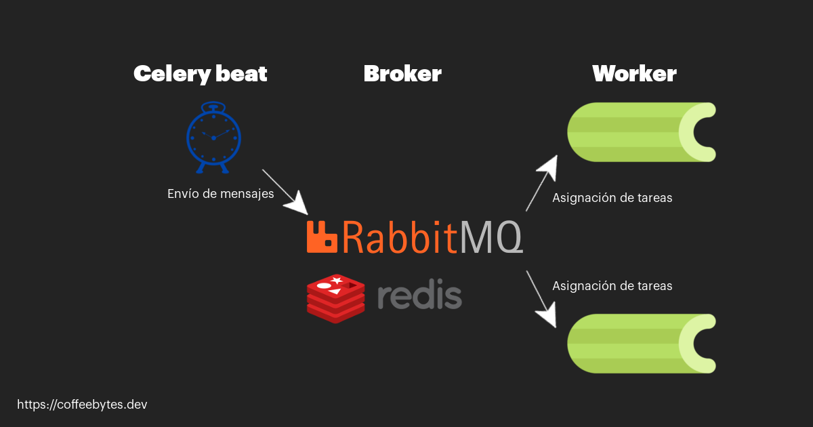

In addition to creating asynchronous tasks, celery also allows you to create periodic tasks, which are executed from time to time. This can be quite useful to give maintenance to the database from time to time, to send marketing or shopping cart recovery emails, perhaps even to empty the contents of some temporary cache in the database or any repetitive task where execution time is an important factor, that is, to improve the performance of a django application.

## Installation and configuration of Celery in Django

The first step is to install Celery:

```bash
pipenv install "celery==5.1.2"
```

As with asynchronous tasks, we also need rabbitmq or another broker.

```bash
sudo apt install rabbitmq-server
```

Next, at the same level as our configuration file, we will create a file called _celery.py_, where we will create a celery app and pass the django configuration to it.

```python
# celeryApp/celery.py
import os
from celery import Celery

os.environ.setdefault('DJANGO_SETTINGS_MODULE', 'celeryApp.settings')
app = Celery('celeryApp')
app.config_from_object('django.conf:settings', namespace='CELERY')
app.autodiscover_tasks()
```

If you have doubts about what each line means or what rabbitmq is for, please visit my post about celery and django.

We also import celery into our _init__.py_ file in our django project.

```python
# celeryApp/__init__.py
from .celery import app as celery_app
__all__ = ('celery_app',)
```

Sounds pretty obvious, but still I remind you; your django application must be running for celery to work.

## Periodic sending of tasks with crontab

For this example we are going to send emails periodically. To achieve this, we are going to add our periodic tasks in the file we just created

First we are going to define the function that we want to execute, in this case it will only send an email, using the django function and taking the data of its arguments.

```python
# celeryApp/celery.py
from django.core.mail import send_mail
# ...

@app.task
def send_my_email(subject, message, fromEmail, recipients):
    send_mail(
        subject,
        message,
        fromEmail,
        recipients,
        fail_silently=False,
    )
```

Now let's set up the celery configuration.

```python
# celeryApp/celery.py
from django.core.mail import send_mail
# ...

@app.on_after_configure.connect
def setup_periodic_tasks(sender, **kwargs):
    sender.add_periodic_task(10.0, send_my_email.s('subject', 'message', 'from@example.com', ['to@example.com']), name='Envia email cada 10 segundos')

@app.task
def send_my_email(subject, message, fromEmail, recipients):
    send_mail(
        subject,
        message,
        fromEmail,
        recipients,
        fail_silently=False,
    )
```

The decorator _@app.on_after_configure_ tells celery that these functions will be programmed once the configuration is complete.

Our function is going to receive a messenger (sender) as a parameter, we will call its _add_periodic_task()_ method to tell it how often we want our task to be executed and then we will call the _s()_ method of the function we define.

_add_periodic_task_() receives as first argument the interval in seconds that we want to elapse between each task and the second is our function executing the _s()_ method with its arguments.

We define our function and decorate it with _@app.task_.

For our periodic scheduling to work, celery needs to be running beat.

## beat in celery

What is Beat? Beat is one of your services that takes care of scheduled tasks. Beat is in charge of reading and sending the scheduled tasks to the celery workers that will execute them.

```python
celery -A celeryApp beat -l info
```



Celery Beat Schematic

Since beat needs to transmit its tasks to a worker, it will be necessary to create one.

```python
celery -A celeryApp worker -l info
```

Now celery will make sure that an email is sent every 10 seconds (pure spam, I know).

Once the celery services are running we will see how our function starts executing every 10 seconds.


Celery tasks within 10 seconds of each other

## Tasks scheduled with crontab

What if instead of specifying an interval to execute the tasks we want them to be executed on a specific date, for example: every Sunday at 1:30 am.

Instead of calculating the seconds we can create a more friendly format with the crontab utility provided by celery.

Yes, you are correct, crontab shares the format with the [crontab file used by the GNU/Linux cron daemon](/en/cron-and-crontab-schedules-recurring-tasks/), which I already talked about in a post.

Crontab will ensure that the execution format is every Monday at 7:30 a.m.

```python
# celeryApp/celery.py
from celery.schedules import crontab

# ...

@app.on_after_configure.connect
def setup_periodic_tasks(sender, **kwargs):
    # ...
    sender.add_periodic_task(
        crontab(hour=7, minute=30, day_of_week=1),
        send_my_email.s('subject', 'message', 'from@example.com', ['to@example.com']),
    )
# ...
```

You can see more details directly in the [Celery documentation](https://docs.celeryproject.org/en/stable/userguide/periodic-tasks.html)