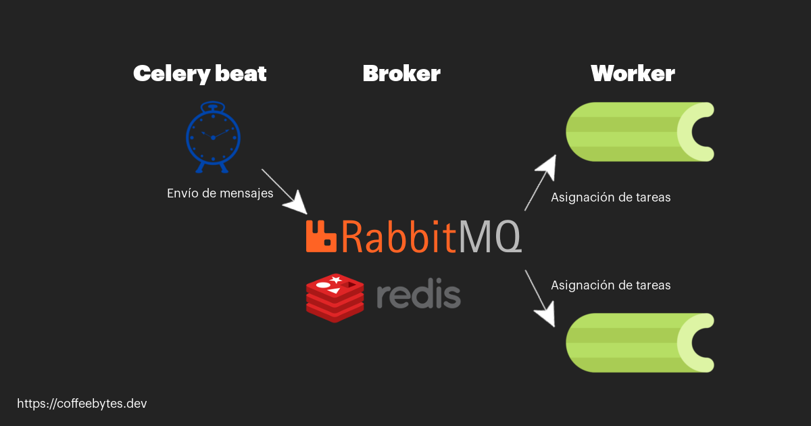
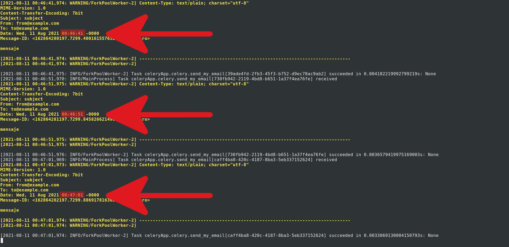

Además de crear tareas asíncronas, celery también permite crear tareas periódicas, que se ejecuten cada cierto tiempo. Esto puede ser bastante útil para darle mantenimiento a la base de datos cada cierto tiempo, enviar emails de marketing o de recuperación de carritos de compra, quizás incluso para vaciar el contenido de alguna cache temporal en la base de datos o cualquier tarea repetitiva en la que el tiempo de ejecución sea un factor importante, es decir para mejorar el rendimiento de una aplicación de django.

## Instalación y configuración de Celery en Django

El primer paso es instalar Celery:

```bash
pipenv install "celery==5.1.2"
```

De igual manera que con las tareas asíncronas, también necesitamos rabbitmq u otro broker.

```bash
sudo apt install rabbitmq-server
```

A continuación, en el mismo nivel que nuestro archivo de configuración, vamos a crear un archivo llamado _celery.py_, donde crearemos una app de celery y le pasaremos la configuración de django.

```python
# celeryApp/celery.py
import os
from celery import Celery

os.environ.setdefault('DJANGO_SETTINGS_MODULE', 'celeryApp.settings')
app = Celery('celeryApp')
app.config_from_object('django.conf:settings', namespace='CELERY')
app.autodiscover_tasks()
```

Si tienes dudas sobre que significa cada linea o para que sirve rabbitmq, por favor visita mi entrada sobre celery y django.

También importamos celery en nuestro archivo _\_\_init\_\_.py_ de nuestro proyecto de django.

```python
# celeryApp/__init__.py
from .celery import app as celery_app
__all__ = ('celery_app',)
```

Suena bastante obvio, pero aún así te lo recuerdo; tu aplicación de django debe estarse ejecutando para que celery funcione.

## Envío periódico de tareas con crontab

Para este ejemplo vamos a enviar emails de manera periódica. Para conseguirlo, vamos a agregar nuestras tareas periódicas en el archivo que acabamos de crear

Primero vamos a definir la función que queremos que se ejecute, en este caso solo enviará un mail, usando la función de django y tomando los datos de sus argumentos.

```python
# celeryApp/celery.py
from django.core.mail import send_mail
# ...

@app.task
def send_my_email(subject, message, fromEmail, recipients):
    send_mail(
        subject,
        message,
        fromEmail,
        recipients,
        fail_silently=False,
    )
```

Ahora vamos a establecer la configuración de celery.

```python
# celeryApp/celery.py
from django.core.mail import send_mail
# ...

@app.on_after_configure.connect
def setup_periodic_tasks(sender, **kwargs):
    sender.add_periodic_task(10.0, send_my_email.s('subject', 'message', 'from@example.com', ['to@example.com']), name='Envia email cada 10 segundos')

@app.task
def send_my_email(subject, message, fromEmail, recipients):
    send_mail(
        subject,
        message,
        fromEmail,
        recipients,
        fail_silently=False,
    )
```

El decorador _@app.on\_after\_configure_ le indica a celery que estas función va a programarse una vez se termine de configurar.

Nuestra función va a recibir un mensajero (sender) como parámetro, llamaremos a su método _add\_periodic\_task()_ para decirle cada cuanto tiempo queremos que se ejecute nuestra tarea y luego llamaremos al método _s()_ de la función que definamos.

_add\_periodic\_task_() recibe como primer argumento el intervalo en segundos que queremos que transcurra entre cada tarea y el segundo es nuestra función ejecutando el método _s()_ con sus argumentos.

Definimos nuestra función y la decoramos con _@app.task_.

Para que nuestra programación periódica funcione, celery necesita estar ejecutando beat.

## beat en celery

¿Qué es Beat? Beat es uno de sus servicios que se encarga de tareas calendarizadas. Beat se encarga de leer y mandarle las tareas calendarizadas a los workers de celery que las ejecutarán.

```python
celery -A celeryApp beat -l info
```



Esquema de Celery Beat

Dado que beat requiere transmitirle sus tareas a un worker, será necesario crear uno.

```python
celery -A celeryApp worker -l info
```

Ahora celery se encargará de que se envié un email cada 10 segundos (spam puro, ya sé).

Una vez que estén corriendo los servicios de celery veremos como se empieza a ejecutar nuestra función cada 10 segundos.



Tareas de Celery con 10 segundos de diferencia entre sí

## Tareas calendarizadas con crontab

Que tal si en lugar de especificar un intervalo para ejecutar las tareas queremos que se ejecuten en una fecha en concreto, por ejemplo: todos los domingos a la 1:30 a.m.

En lugar de calcular los segundos podemos crear un formato más amigable con la utilidad crontab que nos proporciona celery.

Sí, estás en lo correcto, crontab comparte el formato con [el archivo crontab que usa el daemon cron de GNU/Linux](https://coffeebytes.dev/cron-y-crontab-programa-tareas-periodicas/), del que ya hablé en una entrada.

Crontab se encargará de que el formato de ejecución sea todos los lunes a las 7:30 a.m.

```python
# celeryApp/celery.py
from celery.schedules import crontab

# ...

@app.on_after_configure.connect
def setup_periodic_tasks(sender, **kwargs):
    # ...
    sender.add_periodic_task(
        crontab(hour=7, minute=30, day_of_week=1),
        send_my_email.s('subject', 'message', 'from@example.com', ['to@example.com']),
    )
# ... 
```

Puedes ver más detalles directo en la [documentación de Celery](https://docs.celeryproject.org/en/stable/userguide/periodic-tasks.html)
