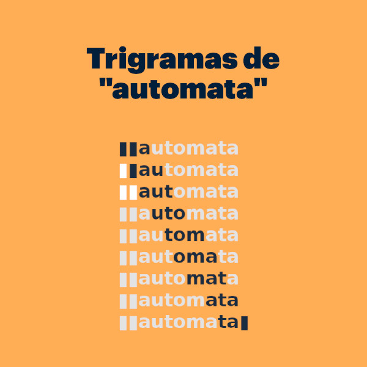
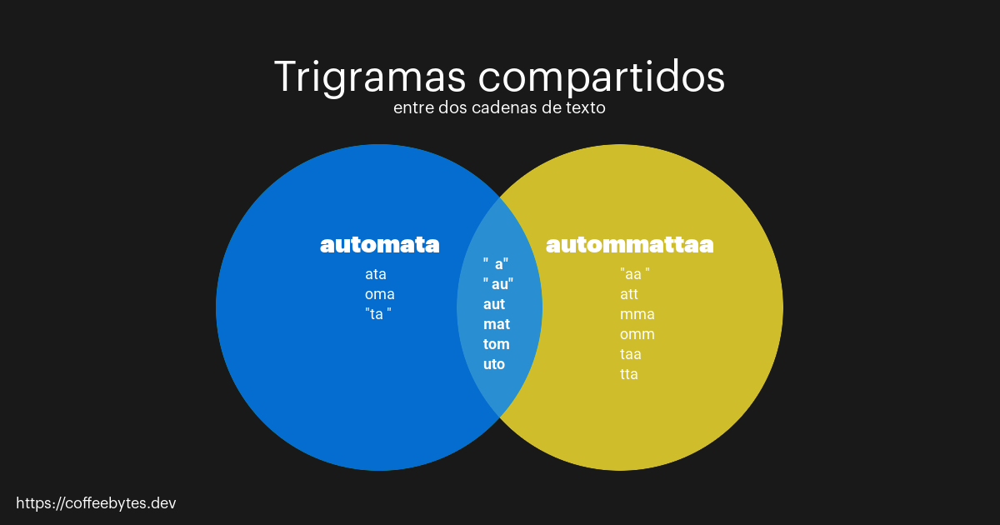
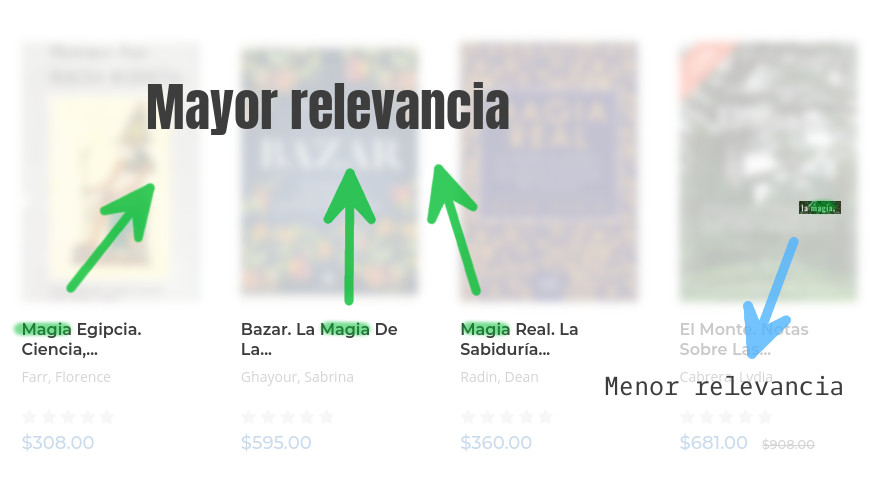

---
aliases:
- /trigramas-y-busquedas-avanzadas-con-django-y-postgres
- /trigramas-y-busquedas-avanzadas-con-django-y-postgres/feed/
authors:
- Eduardo Zepeda
categories:
- django
- bases de datos
coverImage: images/Busquedas-avanzadas-con-trigramas.jpg
coverImageCredits: 'Créditos: https://www.pexels.com/es-es/@pepecaspers/'
date: '2021-05-17'
description: Te muestro lo básico sobre las búsquedas de texto avanzadas usando trigramas
  e indices de similitud y otros, usando Django y Postgres.
keywords:
- orm
- django
- python
- postgres
title: Trigramas y búsquedas avanzadas con Django y Postgres
---

¿Qué pasa si el dedo de un usuario resbala por el teclado y escribe "parfume" en lugar de "perfume". Probablemente no querramos que nuestro usuario abandone el sitio porque no encontró ningún "parfume" en nuestro sitio web. Nuestro sitio web debería de devolverle los resultados que más se parezcan a lo que está buscando. Mira como lo maneja un ecommerce con experiencia:


¿No recuerdas las búsquedas básicas en Django? Tengo una entrada sobre [búsquedas básicas y full text search usando Django y Postgres](/es/full-text-search-y-busquedas-con-django-y-postgres/), si no la has leído date una vuelta primero por allá.

## Trigramas en Django y Postgres

Pero, ¿cómo sabe nuestra aplicación que cuando un usuario escribe "parfume" probablemente se refiera a "perfume"?

La razón de que parfume se parezca a perfume es porque ambos contienen trigramas similares.

¿Trigrama? Sí, trigrama, de tres y grama. **Un trigrama son tres caracteres consecutivos**, así de sencillo.



Trigramas son tres caracteres consecutivos



## Trigramas y palabras similares

Según [Postgres](https://www.postgresql.org/docs/12/pgtrgm.html), **podemos saber que tan similares son dos cadenas de texto comparando el número de trigramas que comparten.** Y Django nos provee funciones para trabajar con trigramas.

```python
Videogame.objects.filter(name__trigram_similar="automatta") # debería decir automata
<QuerySet [<Videogame: Nier automata>]>
Videogame.objects.filter(name__trigram_similar="autommattaa") # debería decir automata
<QuerySet [<Videogame: Nier automata>]>
#...FROM "videogame_videogame" WHERE UNACCENT("videogame_videogame"."name") % UNACCENT(autommata)
```

Mira los trigramas para la palabra "automata" directo desde la terminal de postgres

```sql
SELECT show_trgm('automata');
                  show_trgm                  
---------------------------------------------
 {"  a"," au",ata,aut,mat,oma,"ta ",tom,uto}
```

Ahora observa los trigramas para "automatta" (si no lo notaste, este tiene doble "t")

```sql
SELECT show_trgm('autommattaa');
                        show_trgm                        
---------------------------------------------------------
 {"  a"," au","aa ",att,aut,mat,mma,omm,taa,tom,tta,uto}
```

¿Puedes notar como ambos comparten algunos trigramas? (a, au, aut, mat, tom, uto)



Observa también que las comillas alrededor de ciertos trigramas son para especificar trigramas con espacios

**La cantidad de trigramas que comparten un par de cadenas de texto puede expresarse por medio de un índice**. A mayor cantidad de trigramas compartidos mayor será este índice.

Podemos encontrar el índice de similitud, de acuerdo a sus trigramas, entre dos palabras desde la terminal de postgres.

```sql
SELECT word_similarity('outer worlds', 'wilds');
 word_similarity 
-----------------
          0.1875
```

### Ordenar por similaridad con trigramas

¿Y que pasa si queremos que nuestra búsqueda en Django encuentre incluso aquellas palabras que coinciden en una menor cantidad de trigramas?

Usando el ORM de Django **con la función _TrigramSimilarity_ podemos filtrar aquellos resultados estableciendo un límite de similaridad** entre una palabra de búsqueda y nuestros datos.

Si no recuerdas para que sirve Django annotate, tengo una entrada donde te explico [django annotate y aggregate, así como sus diferencias.](/es/django-annotate-y-aggregate-explicados/)

```python
from django.contrib.postgres.search import TrigramSimilarity

results = Videogame.objects.annotate(similarity=TrigramSimilarity('name', 'wilds'), ).filter(similarity__gt=0.1).order_by('-similarity')
<QuerySet [<Videogame: Outer wilds>, <Videogame: Outer worlds>]> # Con un indice de similaridad de 0.1 wilds y worlds coinciden
results[0].similarity
# 0.5
# ...SIMILARITY("videogame_videogame"."name", wilds) AS "similarity" FROM "videogame_videogame" WHERE SIMILARITY("videogame_videogame"."name", wilds) > 0.1 ORDER BY "similarity" DESC
```

## Search rank para ordenar por relevancia

Si un usuario busca una laptop y tu aplicación le muestra primero fundas para laptop, mochilas para laptop, demás artículos relacionados y hasta el final las laptops, estás brindándole una experiencia inadecuada como usuario.


Search Rank te permite ordenar las búsquedas de los usuarios por relevancia, para que tu usuario encuentre exactamente lo que está buscando primero y luego todo lo demás.

```python
from django.contrib.postgres.search import SearchQuery, SearchRank, SearchVector

vector = SearchVector('name')
query = SearchQuery('days')
resultado = Videogame.objects.annotate(rank=SearchRank(vector, query)).order_by('-rank')
resultado[0].rank
# 0.0607927
# ... ts_rank(to_tsvector(COALESCE("videogame_videogame"."name", )), plainto_tsquery(days)) AS "rank" FROM "videogame_videogame" ORDER BY "rank" DESC
```

Search Rank, con ayuda de la función to\_tsvector y plainto\_tsquery, ordenará nuestros resultados de búsqueda de acuerdo a las coincidencias que encuentre entre el vector y el query y **retornará cada uno de los resultados de nuestra consulta con una propiedad rank que muestra el valor para su respectivo elemento.**

### Asignar importancia por campo

En una búsqueda, no todos los campos deberían importar igual

Imagínate que tienes una base de datos de libros y un modelo Libro con un campo título y un campo contenido. Si un usuario busca libros de "magia", probablemente lo correcto sería devolverle libros que contengan "magia" en el título, como "Magia hechizos y ceremonias" o "Rituales mágicos" o "Historia de la magia".

Por otro lado, los libros de Harry Potter también se relacionan con los intereses del usuario, ya que mencionan múltiples veces la palabra "magia" en su descripción, sin embargo, probablemente quieras que tu búsqueda priorice a aquellos que contengan la palabra "magia" en el título, no en la descripción.



Con Posgres es posible lo anterior.

Par ello, le asignamos un peso, ponderación, prioridad o como quieras llamarle, en forma de letra, a cada vector de búsqueda, junto con el nombre del campo al que corresponde, y los unimos en uno solo.

Podemos elegir entre las letras "A", "B", "C" y "D". Cada letra tendrá un valor diferente de relevancia en nuestra búsqueda; "A" para el mayor valor y "D" para el menor.

```python
from django.contrib.postgres.search import SearchQuery, SearchRank, SearchVector
vector = SearchVector('titulo', weight='A') + SearchVector('descripcion', weight='B')
query = SearchQuery('magia')
Libro.objects.annotate(rank=SearchRank(vector, query)).filter(rank__gte=0.3).order_by('rank')
```

Exactamente tienen los siguientes valores:

- D = 0.1
- C = 0.2
- B = 0.4
- A = 1.0

Estos valores pueden sobreescribirse para adaptarse a tus necesidades, de acuerdo al tipo de negocio y modelos que uses.

```python
Libro.objects.annotate(rank=SearchRank(vector, query), weights=[0.1, 0.2, 0.3, 0.9]).filter(rank__gte=0.3).order_by('rank').filter(rank__gte=0.3).order_by('rank')
```

En el ejemplo de arriba, he reescrito los valores originales y he disminuido los valores de las letras "D","C","B" para que representen un porcentaje mucho menor, en comparación con la letra "A".

## Librerías de Django para búsquedas avanzadas

Quizás tus necesidades búsqueda son mucho más avanzadas que las que provee el ORM de Django combinado con Postgres. Pero, a menos que estés desarrollando algo que revolucione la industria de la búsqueda, alguien ya ha pasado por el mismo problema. Hay soluciones genéricas, como [Solr y Django-haystack](/es/busquedas-con-solr-con-django-haystack), que te ahorran la escritura de muchísimas lineas de código. Algunos ejemplos son:

- [Xapian](https://xapian.org/)
- [Whoosh](https://whoosh.readthedocs.io/en/latest/intro.html)
- [Django haystack](https://django-haystack.readthedocs.io/en/master/index.html)
- [Django watson](https://github.com/etianen/django-watson)